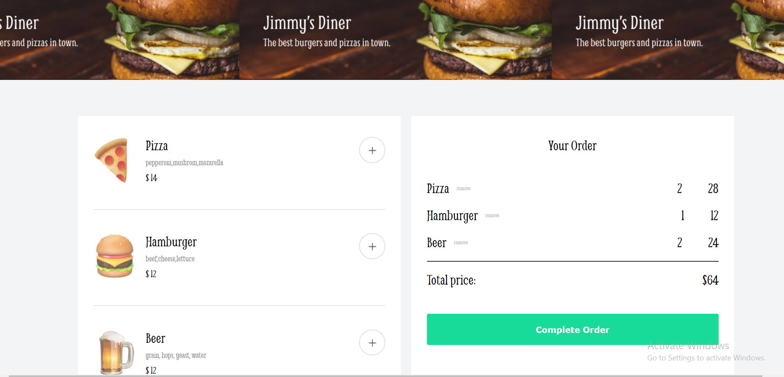

# Online restaurant menu
 Solo project from [scrimba](https://scrimba.com/learn/frontend).

 Built using HTML , CSS , Vanilla JS

 Idea of this project is to create an online restaurant menu to be able to order food online.

 ## Preview
 

  

  

  

 

## Project Walkthrough :

1. First add items to create an order.
2. If you are happy with the order click "Complete order".
3. Fill out name, credit card number and CVV in order to be able to make the order. After that click "Complete order".
4. Your order has been submitted.
5. Rate your experience.

<h3>Project is deployed here - 
    <a href="https://inspiring-llama-bcac6b.netlify.app/" alt="resturant-app-link">Resturant App</a>
</h3>